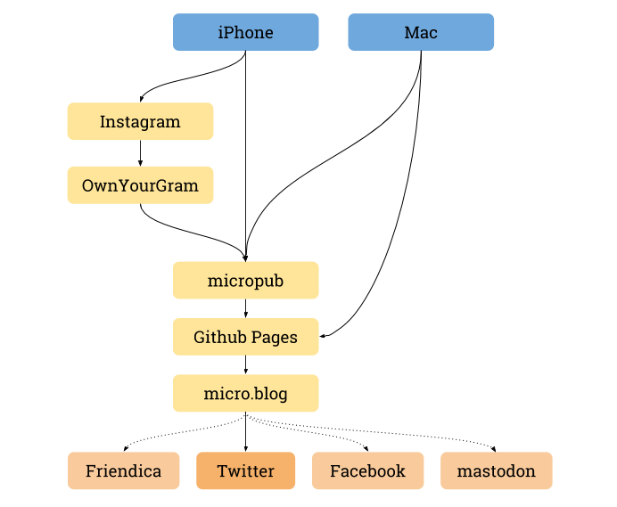

Yesterday I was stuck in a commute situation, so I had a rare moment of boredom and reflection and decided to google `jekyll microblogging` to find out how easy it would be to make my blog fit smaller content chunks. I felt like gathering what I'm emitting on my home turf, at [www.sendung.de](https://www.sendung.de/), which is a Jekyll site served by Github Pages.

What I found was [a great post by Fiona Voss](http://fionavoss.blog/2018/04/01/microblogging-in-jekyll/) that shows a way to re-claim my content by using my own blog as the center of my conversation in other channels. And it opens a door to phenomenons like the [IndieWeb](https://indieweb.org/), [MicroPub](https://indieweb.org/Micropub), and [POSSE](https://indieweb.org/POSSE).

Shortcut into a possible future: Fiona has given this approach up by now. She abandoned her own Jekyll site for performance reasons. Publishing became too slow over time, as the number of posts grew. Read more about it [in her update](http://fionavoss.blog/2018/09/25/how-i-microblog/) if you like. I for my part decided to deal with that problem once/if I actually have it, which is not now.

Here is what I am doing now, roughly:

Depending on what content I am publishing, I can use one of several methods.

- Longer articles that contain both text and images, like this one, I write in a text editor and commit them into [my Github repo](https://github.com/marians/www.sendung.de).

  All content in my repo is picked up by a [micro.blog](https://micro.blog/) site via my blog's RSS feed. From there, content is cross-published to Twitter, following [a few rules](http://help.micro.blog/2016/cross-posting-twitter/). In the case of an article like this, the title and URL will be posted on Twitter.

- Photos that I am publishing on Instagram are automatically picked up by [OwnYourGram](https://ownyourgram.com/) (thanks [Aaron Parecki](http://aaronparecki.com/)!). The service also pushes new (and older, to my surprise) photos into blog posts in my Jekyll/Github Pages site.

- Little notes, i. e. texts that don't justify opening a text editor and fiddling with git, I can now write on the PC or on the mobile.

What is that thing called `micropub` in the center of the flow diagram?

It is really the component that enables fast and simple publishing into the Github pages repository. It offers a Micropub API with OAuth authentication on the one side. This opens up publishing to a variety of compatible clients, be it mobile, desktop, web or whatever.

As recommended by Fiona in the post mentioned earlier, I am using [webpage-micropub-to-github](https://github.com/voxpelli/webpage-micropub-to-github) by Pelle Wessmann. It is especially designed for Jekyll sites hosted on Github Pages. The configuration (via environment variables) is flexible enough for me to run it in a Docker container without code changes.

One of the Micropub clients I have tested out and found helpful is [micropublish.net](https://micropublish.net/). It seems to be more than sufficient for quickly posting a link or a note of a few lines.

So this leaves me with a couple of options.

- Small notes can be posted via any device. If I want them to appear in my blog as well as on Twitter, and in my micro.blog of course, I can simply use a Micropub clients like micropublishing.net.

- Publishing a photo is easiest using my Instagram account. This will also appear in micro.blog, in my blog, on Twitter. It's just that I don't want my Instagram feed to be about everything and nothing, but that's a different problem to talk about.

- If I don't want something to appear on my blog, maybe because it's just not important enough, but want it in micro.blog and Twitter, I post to my micro.blog. The iOS app has good support for a combination of image and text and makes it nearly as easy as using the Twitter iOS app, with the difference that in micro.blog I could also send the content elsewhere.

- Longer articles I will likely still write in an editor and then push to my blog directly. It will be picked up by micro.blog, which then syndicates it to Twitter and potentially other outlets.

The _other outlets_ part is still open. I might get there.

My blog supporting smaller formats now at least lowers the barrier, giving me the feeling that this is not a dead channel. The next best question for me is no longer: Where to publish? How to publish? What to publish with?

The next best question is: What to publish about?
