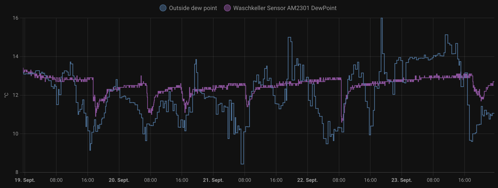

As many people, we have a basement where we store way too many things. On top of that, it's where we wash and tumble-dry our clothes. Our biggest concern is that we might get mold one day. High air humidity is a big factor in mold growth, so we aim to keep the humidity low and we constantly monitor the humidity.

## How to keep the basement dry?

In the beginning we started with putting little hygrometers in the basement rooms. These were soon rising above 60, 65, sometimes over 70 percent. So let's open the windows and let the humid air out.

We learned that air exchange didn't actually get the relative humidity value down. Sometimes it was quite the opposite. Clearly the outside air was as humid or more humid than the air inside. So we started monitoring outside humidity, too, to decide when to ventilate.

This only worked at the rare times when outside and inside temperatures were roughly the same. But when it was warmer outside than inside, ventilation would actually result in more humnidity inside, even if the relative humidity outside was lower. How?

Relative humidity is a measure for the amount of water contained in an amount of air, compared to the maximum amount of water that the air can hold at a given temperature.

Let's say, the air outside at 20 °C has 65 percent relative humidity. In the basement it's 15 °C and 7 percent. Time to ventilate? No. The outside air holds 11.2 grams of water per cubic meter, while in the basement it's 9,6 grams. [Calculate for yourself](https://www.calculator.net/dew-point-calculator.html?airtemperature=20&airtemperatureunit=celsius&humidity=65&dewpoint=&dewpointunit=celsius&x=Calculate). Cooled down to 15 °C, the air we would let into the basement would have a relative humidity of 89 percent – much higher than the value we started from.

Relative humidity is useless for our purpose. I would argue, this measure does more harm than good.

## Dewpoint to the rescue

Furtunately, some devices present another value for humidy: the dewpoint. The dewpoint is the temperature at which the air would be saturated with water. If the air is cooled down to this temperature, water will condense out of the air.

Basically it's an absolute measure for humidity in the air. The higher the number, the more water is in the air. (I recommend to simply ignore the unit. Thinking of it as a temperature value might be confusing again, and we don't want confusing.)

To decide whether it's a good time to ventilate, simply compare the dewpoint value for outside and inside. If outside is lower, open the windows. Close them at some point to prevent the rooms from cooling down (or heating up) too much, or once the outside dewpoint is higher than the inside value.

The graph above shows two dewpoint values we track via Home Assistant. The blue line shows the outside value, taken from a local weather station. The pink line indicates the inside value, measured by a AM2301 sensor in the basement.
